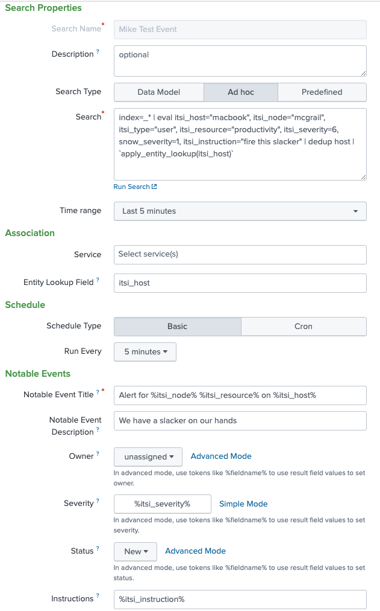
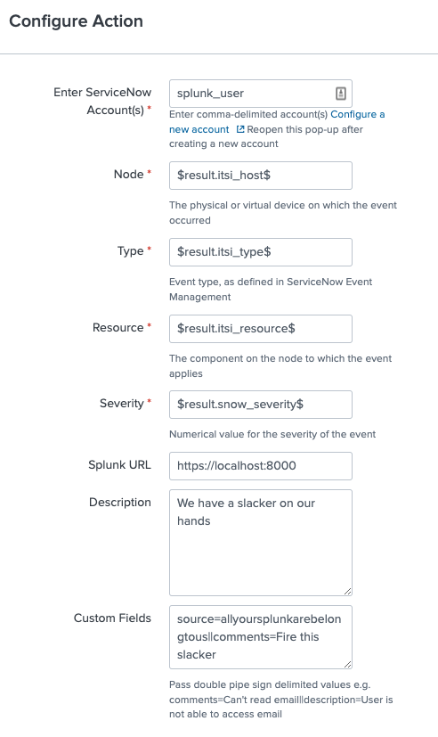
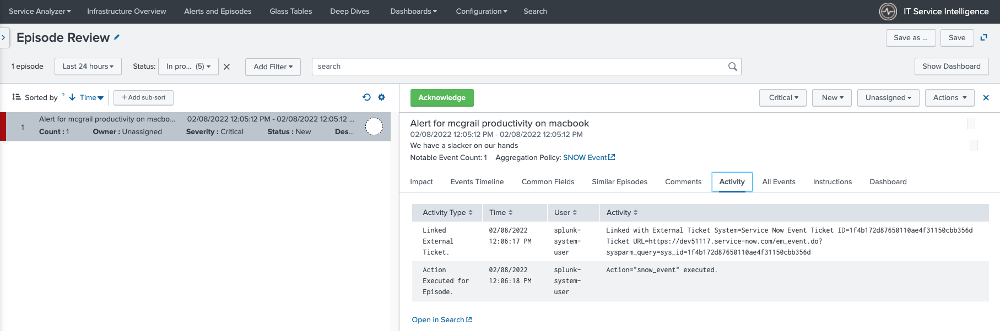
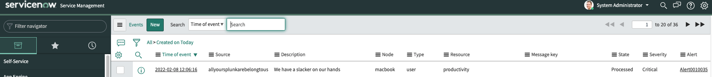
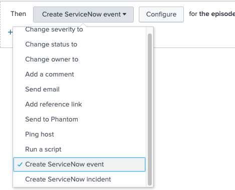

# Splunk-ITSI-to-SNOW-Event
Splunk ITSI -> ServiceNow events

This app extends the ITSI ServiceNow integration to enable an event action for ServiceNow events (OOB only supports SNOW incidents).  

## Development Environment:
- Splunk version 8.2.4
- IT Service Intelligence version 4.11.3
- Splunk Add-on for ServiceNow version 7.1.1

## Prerequisites:
1. [ServiceNow Event Management](https://docs.servicenow.com/bundle/paris-it-operations-management/page/product/event-management/task/t_EMActivatePlugin.html) installed and configured
2. [Splunk Add-on for ServiceNow](https://splunkbase.splunk.com/app/1928/) installed and configured
3. Splunk and ServiceNow integrated as per [documentation](https://docs.splunk.com/Documentation/AddOns/released/ServiceNow/ConfigureServiceNowtointegratewithSplunkEnterprise)

## Notes and Considerations:
- This integration is one-way because ServiceNow events are handled downstream and can be mapped to alerts, incidents, etc.
- Following the [same notes](https://docs.splunk.com/Documentation/AddOns/released/ServiceNow/Commandsandscripts#Supported_arguments_for_events) from the ServiceNow add-on, only new events can be created (existing events cannot be updated)
- Since ServiceNow event management is managed downstream, consideration is needed for managing and closing events in ITSI (example via data values, paused flow of events, or time)

## Installation and Usage:
1. Extract .tgz to $SPLUNK_HOME/etc/apps/

2. Create ITSI correlation search to populate normalized fields (note SeviceNow has its own severity mapping)

3. Select "ServiceNow Event Integration" from the actions drop-down (for manual trigger via episodes alert action; for automated trigger via notable event aggregation policy)

4. After triggering, validate in ITSI episode action

5. Validate event in ServiceNow (note message_key field could be defined in ITSI "Custom Fields" or in the ServiceNow table; default is blank)

## Optional Additional Modification:
To change the action verbiage from "ServiceNow Event Integration" to "Create ServiceNow event" in order to align with the OOB incident integration, replace $SPLUNK_HOME/etc/apps/itsi/appserver/static/build/pages/common.js with the provided version.

Note this will get overwritten with an ITSI upgrade and is applicable only for version 4.11.3 (build 18326).